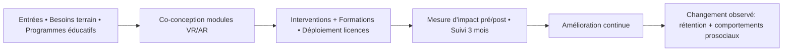

# 🎯 PLAYI — Mission · Vision · Valeurs (Visual .md)

*Version : 2025‑09‑16*
*Format : Markdown visuel — prêt à copier/coller dans Notion, GitHub, Google Docs.*

---

## 🧭 Mission (affiche)

> **Nous aidons les écoles, collectivités et associations à développer des compétences sociales et citoyennes chez les jeunes** grâce à des **modules VR/AR** immersifs, **mesurables** et **sécurisés**, pour transformer l’apprentissage en **expériences qui marquent et durent**.

**Focus immédiat** : Éducation & jeunesse · Interventions + licences · Mesure d’impact pré/post · Conformité RGPD.

---

## 🗺️ Vision 2030/2035 (panorama)

```
Occitanie → France (réseau national)
┌───────────────┬───────────────────────────────────────────────────────┐
│ Portée        │ 300+ établissements/an • 50 000+ apprenants/an        │
├───────────────┼───────────────────────────────────────────────────────┤
│ Transformation│ Rétention +30% à 3 mois • Comportements prosociaux ↑ │
├───────────────┼───────────────────────────────────────────────────────┤
│ Différenciation│ Catalogue d’escape games + moteur d’analytique d’impact │
├───────────────┼───────────────────────────────────────────────────────┤
│ Modèle        │ 60% licences annuelles • 40% interventions/formation │
├───────────────┼───────────────────────────────────────────────────────┤
│ Ligne rouge   │ jamais data marchande • jamais contenus stigmatisants │
└───────────────┴───────────────────────────────────────────────────────┘
```

**Avant → Après (image mentale)**

| **Avant** (sensibilisation passive)   | **→** | **Après** (expérience PLAYI)           |
| ------------------------------------- | :---: | -------------------------------------- |
| Exposé descendant, attention variable |   ➜   | Escape‑game VR/AR, engagement actif    |
| Peu de traces d’apprentissage         |   ➜   | Indicateurs pré/post et suivi à 3 mois |
| Message générique                     |   ➜   | Scénarios co‑construits terrain        |
| Inégalités d’accès                    |   ➜   | Modes alternatifs, inclusion by design |

---

## 🧱 Valeurs (maison des valeurs)

```
           ┌────────────────────────────────────────────┐
           │         🎓 IMPACT PÉDAGOGIQUE D’ABORD      │  ← Toit
           └────────────────────────────────────────────┘
                 │            │             │
                 ▼            ▼             ▼
        🛡️ INTÉGRITÉ    🤝 CO‑CONSTRUCTION    🔧 FRUGALITÉ
            & PROTECTION          TERRAIN        EFFICACE
                 │                              
                 ▼            ♿ ACCESSIBILITÉ & INCLUSION
```

**Comportements observables**

* **Impact d’abord** → *Toujours* fixer un objectif mesurable et vérifier pré/post · *Jamais* le « waouh VR » sans effet.
* **Intégrité & protection** → *Toujours* consentement, anonymisation, sécurité · *Jamais* data identifiante inutile.
* **Co‑construction** → *Toujours* pilotes terrain · *Jamais* solution « hors‑sol ».
* **Frugalité efficace** → *Toujours* simple, réutilisable, maintenable · *Jamais* complexité décorative.
* **Inclusion** → *Toujours* options confort, audio/texte · *Jamais* designs excluants.

---

## 🧩 Différenciation & frontières (ce que nous **ne** sommes pas)

* ❌ Événementiel VR one‑shot
* ❌ Studio de jeux grand public
* ❌ Marchand de matériel
* ❌ Projets sans métriques d’apprentissage
* ❌ Gamification addictive

**Lignes rouges** : pas de monétisation des données élèves · pas de contenus sensationnalistes/stigmatisants.

---

## 🔗 Strategy Map (Mermaid)



---

## 📊 KPI Dashboard (lectures rapides)

**Impact pédagogique**

* Pré→Post : **+25% min** ▓▓▓▓▓▓▓▓▓░
* Maintien 3 mois : **≥ 15%** ▓▓▓▓▓▓░░░

**Qualité d’expérience**

* NPS animateurs : **≥ 50** ▓▓▓▓▓▓▓▓░░
* Note apprenants : **≥ 4/5** ▓▓▓▓▓▓▓▓▓░

**Adoption**

* Réutilisation module (6 mois) : **≥ 70%** ▓▓▓▓▓▓▓▓░░
* Séances avec débrief structuré : **80%** ▓▓▓▓▓▓▓▓▓░

**Viabilité**

* MRR licences (18 mois) : **≥ 15 k€** ▓▓▓▓▓▓▓░░░
* Marge brute : **≥ 55%** ▓▓▓▓▓▓▓▓░░
* DSO : **< 45 j** ▓▓▓▓▓▓▓▓▓░

> *Rituels* : revue mensuelle « arbitrages valeurs » + comité trimestriel d’impact (lecture froide des KPI, décisions d’arrêt/pivot).

---

## 🧪 Preuves d’alignement (12 mois)

* 🎯 **100% des modules** avec objectifs d’apprentissage explicites & rubriques d’évaluation.
* 🧪 **3 pilotes** terrain documentés (rapports + itérations).
* 📈 **Tableau de bord impact** partagé avec partenaires (anonymisé).
* 🔐 **Conformité RGPD** auditée (registre, DPA, minimisation data).

---

## 🧭 Positionnement

**PLAYI = VR/AR pédagogiques à impact mesurable**, pensés **avec le terrain**, livrés **simplement**, et **éthiques par design**.

> Pitch couloir : *« On transforme la sensibilisation en expériences VR/AR qui laissent des traces utiles : chaque module a un objectif d’apprentissage clair, on mesure l’avant/après, et on garantit sécurité et éthique des données. »*

---

## 🛑 Non‑objectifs (anti‑dispersion)

* Nous **ne poursuivons pas** : démos spectacle, divertissement pur, ventes de casques, projets sans indicateurs.
* Nous **acceptons de perdre** : contrats exigeant datas nominatives ou messages contraires à nos valeurs.

---

## 🧩 Modèle opératoire (canvas rapide)

```
CLIENTS 🎓 écoles • 🏛️ collectivités • 🤝 associations • 🏢 entreprises (si finalité éducative)
OFFRE   🎮 escape‑games pédagogiques • 🧑‍🏫 formation • 🔁 licences annuelles
PREUVE  📊 pré/post + suivi 3m • 📜 Qualiopi/OPCO/CPF
ÉTHIQUE 🔐 RGPD • 🔎 minimisation • ✅ consentement • 🦺 sécurité en séance
```

---

## 📅 Cadence de revue

* Mensuel : Qualité & Valeurs
* Trimestriel : Impact & Viabilité
* Annuel : Vision & Focus stratégiques

---

### Annexes (à personnaliser)

* Bénéficiaire prioritaire 2025‑2026 : **\[à préciser]**
* Périmètre géographique : **\[à préciser]**
* Seuils KPI : **\[à préciser]**
* Rituels internes détaillés : **\[à préciser]**
